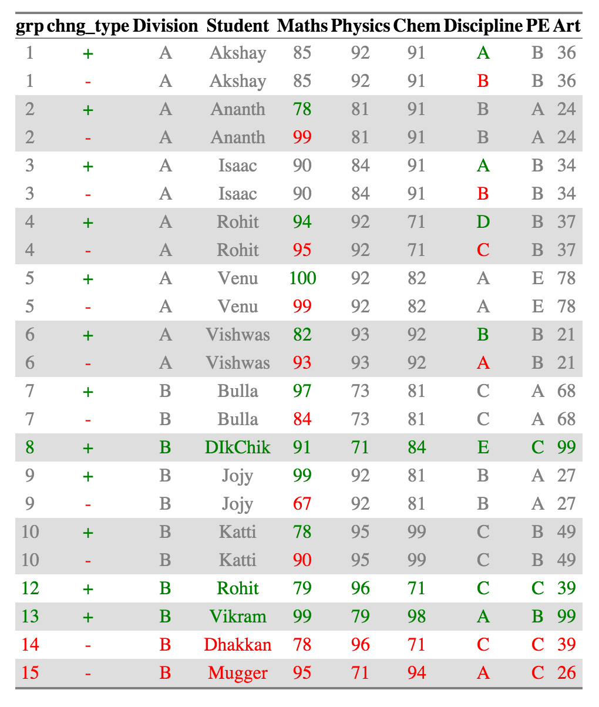

**CRAN Version is upto date with the latest bug fixes as of 2018-09-02**


# compareDF

[](http://codecov.io/github/alexsanjoseph/compareDF?branch=master)
[](https://travis-ci.org/alexsanjoseph/compareDF)
[](https://ci.appveyor.com/project/alexsanjoseph/compareDF)
[](http://cran.r-project.org/package=compareDF)
[](http://www.r-pkg.org/pkg/compareDF)


# Introduction

Every so often while doing data analysis, I have come across a situation where I have
two datasets, which have the same structure but with small differences in the actual
data between the two. For example:

* Variation of a dataset across different time periods for the same grouping
* Variation of values for different algorithms, etc.

In the above cases, I want to easily identify what has changed across the two data.frames,
how much has changed, and also hopefully to get a quick summary of the extent of change. There are
packages like the `compare` package on R, which have focused more on the structure of
the data frame and lesser on the data itself. I was not able to easily identify and
isolate what has changed in the data itself. So I decided to write one for myself. That is
what `compareDF` package is all about.

# Usage

The package has a single function, `compare_df`. It takes in two data frames, and one or 
more grouping variables and does a comparison between the the two. In addition you can 
specify columns to ignore, decide how many rows of changes to be displayed in the case 
of the HTML output, and decide what tolerance you want to provide to detect change.

# Basic Example

Let's take the example of a teacher who wants to compare the marks and grades of students across
two years, 2010 and 2011. The data is stored in tabular format.

```{r}
data("results_2010", "results_2011")
print(results_2010)
print(results_2011)
```

The data shows the performance of students in two divisions, A and B for two years. Some subjects
like _Maths, Physics, Chemistry and Art_ are given scores while others like _Discipline and PE_ are 
given grades. 

It is possible that there are students of the same name in two divisions, for example, there is 
a _Rohit_ in both the divisions in 2011.

It is also possible that some students have dropped out, or added new across the two years. 
Eg: - _Mugger and Dhakkan_ dropped out while _Vikram and Dikchik_ where added in the Division B

The package allows a user to quickly identify these changes.

## Basic Comparison
Now let's compare the performance of the students across the years. The grouping variables are the
_Student_ column. We will ignore the _Division_ column and assume that the student names are unique 
across divisions. In this sub-example, if a student appears in two divisions, he/she has studied in both 
of them.

```{r}
library(compareDF)
ctable_student = compare_df(results_2011, results_2010, c("Student"))
ctable_student$comparison_df

```

By default, no columns are excluded from the comparison, so any of the tuple of grouping 
variables which are different across the two data frames are shown in the comparison table.
The `comparison_df` table shows all the rows for which at least one record has changed. Conversely, if
nothing has changed across the two tables, the rows are not displayed. If a new record has been
introduced or a record has been removed, those are displayed as well.

For example, _Akshay, Division A_ has had the exact same scores but has two different grades for _Discipline_ across 
the two years so that row is included.

However, _Macho, Division B_ has had the exact same scores in both the years for all subjects, so his data is not
shown in the comparison table.

## HTML Output
While the comparison table can be quickly summarized in various forms for futher analysis, it is 
very difficult to  process visually. The `html_output` provides a way to represent this is a way that is easier 
for the numan eye to read. NOTE: You need to install the `htmlTable` package for the HTML comparison to work.
_For the purpose of the readme I am attaching the html as a png because github markdown doesn't retain styles._

```{r, results = 'hide'}
print(ctable_student$html_output)
```


Now it is very easy to see recognize what has changed. A single cell is colored 
if it has changed across the two datasets. The value of the cell in the older dataset
is colored red and the value of the cell in the newer dataset is colored green. Cells
that haven't changed across the two datasets are colored grey.

If a new row was introduced, the Row group names (and all the other columns for that row as well )
are colored in Green. Similarly, a row group name (and the other columns in that row) are
colored red if a row was removed.

For Example, _Akshay_, _Ananth_ and _Bulla_ has had changes in 
scores, which are in _Discipline_, _Maths_, and _Maths_ respectively.
_Dhakkan_ and _Mugger_ have dropped out of the dataset from 2010 and the all the columns for the rows are shown
in red, which _DikChik_ and _Vikram_ have joined new in the data set and all the columns for the rows are in green.

The same data is represented in tabular form (for further analysis, if necessary) in the
`comparison_table_diff` object

```{r}
ctable_student$comparison_table_diff
```

## Change Count and Summary
You can get an details of what has changed for each group using 
the `change_count` object in the output. A summary 
of the same is provided in the `change_summary` object.

```{r}
ctable_student$change_count
```

```{r}
ctable_student$change_summary
```

## Grouping Multiple Columns

We can also group_multiple columns into the grouping variable

```{r, results = 'hide'}
ctable_student_div = compare_df(results_2011, results_2010, c("Division", "Student"))
ctable_student_div$comparison_df
```


Now _Rohits_ in each individual division are considered as belonging to separate 
groups and compared accordingly. All the other summaries also change appropriately.

## Excluding certain Columns

You can ignore certain columns using the *exclude* parameter. The fields that have to be
excluded can be given as a character vector. (This is a convenience function to deal with 
the case where some columns are not included)

## Preserving all rows

The default behavior of the `compare_df` function is to show only the records that have changed. Sometimes the use might want to preserve all the records even after the comparison and not just see the values that have been changed (especially in the HTML). In this case, you can set the `keep_unchanged` parameter to `TRUE`. 


## Limiting HTML size

For dataframes which have a large amount of differences in them, generating HTML might take 
a long time and crash your system. So the maximum diff size for the HTML (and for the HTML
visualization only) is capped at 100 by default. If you want to see more difference, you can change
the `limit_html` parameter appropriately. NOTE: This is only of the HTML output which is used for visual
checking. The main comparison data frame and the summaries ALWAYS include data from all the rows.

## Changing HTML color

You can use the `color_scheme` parameter to change the color of the HTML generated. The parameter must me a named vector or a list with the appropriate names - The default values are `c("addition" = "green", "removal" = "red", "unchanged_cell" = "gray", "unchanged_row" = "deepskyblue")` but can be changed as needed by the user.


## Tolerance

It is possible that you'd like numbers very close to each other to be ignored. For example,
if the marks of a student vary by less that 5% across the years, it could be due to random
error and not any real performance indictaor. In such a case, you would want to give a tolerance
parameter. For this case, giving a tolerance of `0.05` would ignore all the changes that are 
less than 5% apart from the lower value.

```{r, results = 'hide'}
ctable_student_div = compare_df(results_2011, results_2010, c("Division", "Student"), tolerance = 0.05)
ctable_student_div$html_output
```


_Venu from division A_ who had a score change from 100 to 99 is no longer present in the 
diff calculation or in the output

Naturally, tolerance has no meaning for non-numeric values.

## Using compare DF in GAP analysis

The compareDF package can be used to conduct effective Gap analyses. If the package is used in this way, a configuration recommendation should be considered when using the compare_df function. Make sure the group column (group_col argument) being used as the gap classifier is unique and is not duplicated within either of the datasets being compared. Duplicate group names can skew gap analysis results. For example, using the results_2010 and results_2011 samples where Student represents the group_col argument, 'Rohit' group results are skewed. This is because student 'Rohit' is provided in the results_2011 sample twice. In this example Rohit represents two different students with the same last name. In short, if there are more than (2) records per grouping in a typical Gap analysis result, it suggests that there is a duplicate grouping contained within a single dataset that should be renamed and re-identified. If this occurs, changes should be made to the comparison datasets, and the Gap analysis should be re-conducted. The best way to prevent skewed results from occurring is to use all the columns that uniquely define a row in the group column argument - in this case, both name and student columns (alternatively a unique key identifier can also be constructed).

## Acknowledgements

Thanks to Nitin for proofreading the doc and making sure everything made sense.

## Contributors
- Brice Richard
- Joshua David Barillas - https://github.com/jdbarillas

License (MIT)

Copyright (c) 2016 System Insights, Inc.

Permission is hereby granted, free of charge, to any person obtaining a copy of this software and associated documentation files (the 'Software'), to deal in the Software without restriction, including without limitation the rights to use, copy, modify, merge, publish, distribute, sublicense, and/or sell copies of the Software, and to permit persons to whom the Software is furnished to do so, subject to the following conditions:

The above copyright notice and this permission notice shall be included in all copies or substantial portions of the Software.

THE SOFTWARE IS PROVIDED 'AS IS', WITHOUT WARRANTY OF ANY KIND, EXPRESS OR IMPLIED, INCLUDING BUT NOT LIMITED TO THE WARRANTIES OF MERCHANTABILITY, FITNESS FOR A PARTICULAR PURPOSE AND NONINFRINGEMENT. IN NO EVENT SHALL THE AUTHORS OR COPYRIGHT HOLDERS BE LIABLE FOR ANY CLAIM, DAMAGES OR OTHER LIABILITY, WHETHER IN AN ACTION OF CONTRACT, TORT OR OTHERWISE, ARISING FROM, OUT OF OR IN CONNECTION WITH THE SOFTWARE OR THE USE OR OTHER DEALINGS IN THE SOFTWARE.

_A version of this README has been published as a blog [here](http://alexsanjoseph.github.io/r/2016/03/09/comparing-dataframes-in-r-using-comparedf)_
